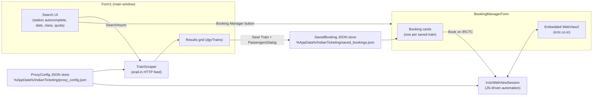

# Architecture

## Overview

The app is two windows over a shared pair of JSON-file data stores. There is no server component — everything runs locally in the WinForms process.

## Startup

[Program.cs](../indian-ticketing/Program.cs) is the entry point. Before showing any UI it runs `CheckTrial()`, which hard-blocks the app once the local clock passes a fixed `TrialExpiry` date (currently 2026-09-04). See [known-issues.md](known-issues.md) for a text/date inconsistency in that dialog. If the trial check passes, it opens [Form1](../indian-ticketing/Form1.cs).

## Form1 — train search

[Form1.cs](../indian-ticketing/Form1.cs) is the main window:

- Builds two custom autocomplete dropdowns (`_fromDropPanel`/`_fromDropList` and the `to` equivalents) directly in code rather than the designer, backed by [StationData.Search](../indian-ticketing/StationData.cs).
- `btnGetTrains_Click` calls `TrainScraper.SearchAsync` and binds the result `List<TrainInfo>` to `dgvTrains`.
- `DgvTrains_CellFormatting` colors cells (train-type color, day-of-week bitmap, availability chips) — purely presentational, no state.
- `btnSaveTrain_Click` takes the selected grid rows, opens `PassengersDialog` once (the same passenger list is applied to every selected train), and appends `SavedBooking` records to the JSON store via `SavedBooking.SaveAll`.
- `btnBookingMgr_Click` opens `BookingManagerForm` as a non-modal child (`.Show(this)`), so both windows can be open simultaneously.

## BookingManagerForm — booking list + automation

[BookingManagerForm.cs](../indian-ticketing/BookingManagerForm.cs) owns:

- A `SplitContainer`: left pane is a `FlowLayoutPanel` of `BookingCard`s (one per `SavedBooking`, loaded via `SavedBooking.LoadAll()`); right pane hosts the single `WebView2` control that actually navigates IRCTC.
- IRCTC credentials and the proxy string as top-bar textboxes. They begin blank and are supplied at run time.
- WebView2 initialization (`InitializeWebViewAsync`): creates a per-app `UserDataFolder` under `%LocalAppData%\Indian Ticketing\WebView2`, applies the proxy as a browser launch argument, loads the generated proxy-auth extension (see [data-and-config.md](data-and-config.md)), and navigates to the IRCTC search page. It also opportunistically auto-fills login if the login form is already showing.
- `StartBooking` / `StartAllBookings` / `StartChain`: each spins up a **new** `IrctcWebViewSession` bound to the *same* `WebView2` instance and calls `RunAsync`. `StartAllBookings` chains bookings sequentially (each one waits for the previous `RunAsync` to complete before starting the next) — there is no parallelism, and all bookings share one browser tab/profile.
- `_qrPopups`: a `Dictionary<SavedBooking, QrPopupForm>` so a re-triggered QR for the same booking updates an existing popup instead of spawning a new window.
- `BookingCard` (defined in the same file) is a small custom `Panel` with train summary, passenger summary, a status label, a "Book on IRCTC" button, an "OK (Continue)" button (enabled only while the session is waiting on `AcknowledgeUserAction`, e.g. for a manual CAPTCHA/OTP the automation couldn't resolve), and a QR `PictureBox`.

## The two IRCTC automation engines

There are **two** independent implementations of "drive IRCTC through a booking":

| | [IrctcWebViewSession.cs](../indian-ticketing/IrctcWebViewSession.cs) | [IrctcBookingSession.cs](../indian-ticketing/IrctcBookingSession.cs) |
|---|---|---|
| Used by the app? | **Yes** — this is what `BookingManagerForm` calls. | **No** — nothing in the project instantiates it. |
| Browser | The app's own embedded `WebView2` (the user sees and can interact with the same browser instance). | A separate, real `ChromeDriver` window launched via Selenium. |
| Interaction model | JavaScript injected into the page (`ExecuteScriptAsync`) plus DevTools Protocol synthetic mouse events for clicks. | Selenium `IWebElement` find/click/type calls. |
| Status | Actively maintained — see the step-by-step comments and the "double-click causes rejection" workarounds. | Effectively a frozen earlier prototype of the same idea. |

See [booking-automation.md](booking-automation.md) for how the active engine (`IrctcWebViewSession`) works, and [known-issues.md](known-issues.md) for why the Selenium path still exists in the tree.

## Threading / async model

- WinForms UI thread runs everything; long operations are `async`/`await` (`TrainScraper.SearchAsync`, `IrctcWebViewSession.RunAsync`) rather than background threads, so UI updates from callbacks (`OnStatus`, `OnQrReady`) still need `this.Invoke(...)` because event handlers can fire from WebView2's own dispatch.
- `IrctcBookingSession` (the unused Selenium path) is the exception: `StartAsync` wraps the whole flow in `Task.Run`, since Selenium calls are synchronous/blocking.
- Manual-intervention pauses (CAPTCHA the OCR couldn't solve, OTP, "select the train yourself") are implemented with a `TaskCompletionSource<bool>` (`_userAckTcs` in `IrctcWebViewSession`, `ManualResetEventSlim` in `IrctcBookingSession`) that the "OK (Continue)" button on the `BookingCard` completes via `AcknowledgeUserAction()`. Both have a 10-minute timeout.

## Data flow summary

1. `TrainScraper` never writes to disk — it's a pure request/parse call, invoked fresh on every search.
2. `SavedBooking` is the only thing that crosses from Form1 into BookingManagerForm, via a JSON file (not in-memory — `BookingManagerForm` re-reads it in its constructor and on "Refresh").
3. `ProxyConfig` is read by both `TrainScraper` (as an `HttpClientHandler.Proxy`) and by the WebView2/Selenium browser launches (as a `--proxy-server` argument + a generated MV2 extension for authenticated proxies).
